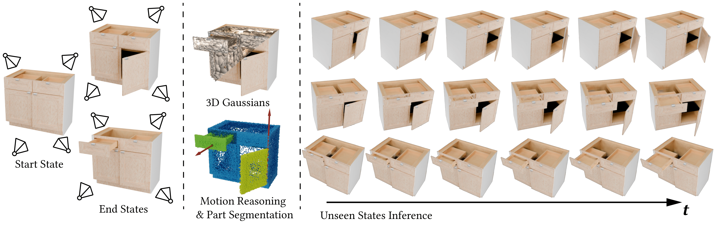
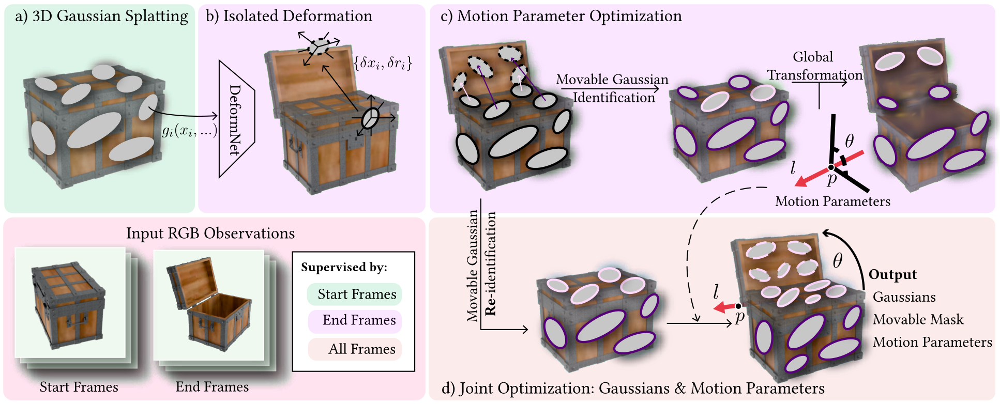

# ArticulatedGS: self-supervised digital twin modeling of articulated objects using 3d gaussian splatting

## [Project page](https://guojunfu-tech.github.io/articulatedGS-io/) | [Paper](https://guojunfu-tech.github.io/articulatedGS-io/static/pdf/paper.pdf)



# Related works
* [ArtGS](https://articulate-gs.github.io/) | [Paper](https://arxiv.org/pdf/2502.19459)
* [DTA](https://github.com/NVlabs/DigitalTwinArt) | [Paper](https://openaccess.thecvf.com/content/CVPR2024/papers/Weng_Neural_Implicit_Representation_for_Building_Digital_Twins_of_Unknown_Articulated_CVPR_2024_paper.pdf)
* [deformable-GS](https://ingra14m.github.io/Deformable-Gaussians/) | [Paper](https://arxiv.org/abs/2309.13101)
* [PARIS](https://github.com/3dlg-hcvc/paris) | [Paper](https://openaccess.thecvf.com/content/ICCV2023/papers/Liu_PARIS_Part-level_Reconstruction_and_Motion_Analysis_for_Articulated_Objects_ICCV_2023_paper.pdf)


## Dataset
* Our dataset is the same as **PARIS**. You can get the dataset from their [links](https://github.com/3dlg-hcvc/paris?tab=readme-ov-file#data)
* If you want to make your own dataset, you can refer to the [build_data]() with [blender](https://www.blender.org/) and [BlenderNeRF](https://github.com/maximeraafat/BlenderNeRF). *TODO*


<!-- ### Build data
Tools: [https://github.com/GuoJunfu-tech/build_data](https://github.com/GuoJunfu-tech/build_data)
(Readme there has not be finished.) -->

<!-- Articulated datasets: [Raw Data](https://aspis.cmpt.sfu.ca/projects/paris/dataset.zip) | [Alternatives](https://1sfu-my.sharepoint.com/:u:/g/personal/jla861_sfu_ca/EeEggZVIENFJm6ZEORQ8QwIBhhlY9El1amq8A9zLl0WQJA?e=Tfs0N7) -->

We organize the datasets as follows:

```shell
├── data
    ├──foldchair
    │   ├── 102255
    │       ├── start
    │           ├── train
    │               ├── 0000.png
    │               ├── ...
    │           ├── val 
    │               ├── 0000.png
    │               ├── ...
    │           ├── test
    │               ├── 0000.png  
    │               ├── ...
    │           ├── camera_train.json
    │           ├── camera_test.json
    │           ├── camera_val.json

    │       ├── end 
    │           ├── same as 'start' file
    ├── laptop
    │   ├── ...
    ├── ...
```


## Pipeline



## Run

### Environment

```shell
git clone https://github.com/GuoJunfu-tech/ArticulatedGaussians --recursive
cd ArticulatedGaussians

conda create -n artigs python=3.7 
conda activate artigs 

# install pytorch
pip install torch==1.13.1+cu116 torchvision==0.14.1+cu116 --extra-index-url https://download.pytorch.org/whl/cu116

# install dependencies
pip install -r requirements.txt
```

### Train
```shell
python train.py 
```
You can modify the training parameters or data address in `cfg_files/train.yaml`. 


### Render & Evaluation

Not implemented yet

